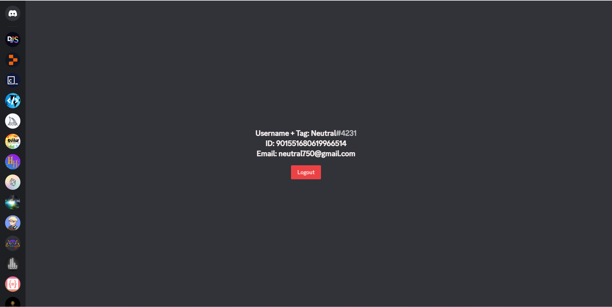

<h1>Discord OAuth2</h1>

A simple discord authentication template for me to refer back to and to simplify for other developers.

<h2>Installation</h2>
<ol>
  <li>Fork or download the project.</li>
  <li>Install all packages by running <b>npm install</b>. The packages used are:</li>
  <ul>
    <li>cookie-parser</li>
    <li>dotenv</li>
    <li>ejs</li>
    <li>express</li>
    <li>path</li>
    <li>
      
    npm i cookie-parser dotenv ejs express path 
  </ul>
  <li>Fill the data in the <a href="https://github.com/Neutral75/Discord-OAuth2/blob/main/.example.env"><b>.example.env</b></a> file. (Change the file name to .env after)</li>
  <li>Go to <a href="https://discord.dev/"><b>Discord.dev</b></a>, then go to your application and add a redirect URI which is the same as the one in the .env file.</li>
  <li>Start the app by running <b>npm start</b>.</li>
  <li>You're all set!</li>
</ol>

The navigation bar has been taken from <a href="https://github.com/theteachr/discord-frontend-replica"><b>here</b></a>. Go check it out and give it a like

